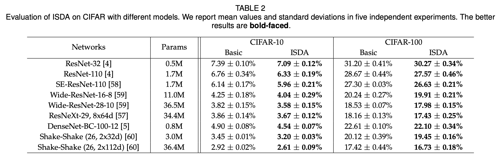
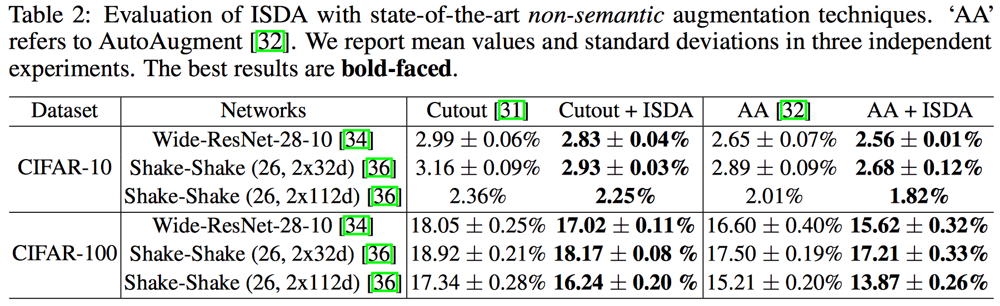

# Implicit Semantic Data Augmentation for Deep Networks **(NeurIPS 2019)**

Code for the paper 'Implicit Semantic Data Augmentation for Deep Networks' (https://arxiv.org/abs/1909.12220)

In this paper, we propose a novel implicit semantic data augmentation (ISDA) approach to complement traditional augmentation techniques like flipping, translation or rotation. ISDA consistently improves the generalization performance of popular deep networks, especially with powerful non-semantic augmentation techniques (like Cutout and AutuAugment).

<p align="center">
    
</p>


If you find this work useful or use our codes in your own research, please use the following bibtex:

```
@ARTICLE{2019arXiv190912220W,
       author = {{Wang}, Yulin and {Pan}, Xuran and {Song}, Shiji and {Zhang}, Hong and
         {Wu}, Cheng and {Huang}, Gao},
        title = "{Implicit Semantic Data Augmentation for Deep Networks}",
      journal = {arXiv e-prints},
     keywords = {Computer Science - Computer Vision and Pattern Recognition, Computer Science - Artificial Intelligence, Computer Science - Machine Learning},
         year = "2019",
        month = "Sep",
          eid = {arXiv:1909.12220},
        pages = {arXiv:1909.12220},
archivePrefix = {arXiv},
       eprint = {1909.12220},
 primaryClass = {cs.CV},
       adsurl = {https://ui.adsabs.harvard.edu/abs/2019arXiv190912220W},
      adsnote = {Provided by the SAO/NASA Astrophysics Data System}
}

```


## Requirements
- python 3.5.4
- torch 1.0.1
- torchvision 0.2.2


## Run

Train Wide-ResNet-28-10 on CIFAR-10 / 100 with ISDA

```
CUDA_VISIBLE_DEVICES=0 python train.py --dataset cifar10 --model wideresnet --layers 28 --widen-factor 10 --combine-ratio 0.5 --droprate 0.3
CUDA_VISIBLE_DEVICES=0 python train.py --dataset cifar100 --model wideresnet --layers 28 --widen-factor 10 --combine-ratio 0.5 --droprate 0.3

```

Train Wide-ResNet-28-10 on CIFAR-10 / 100 with ISDA and AutoAugment

```
CUDA_VISIBLE_DEVICES=0 python train.py --dataset cifar10 --model wideresnet --layers 28 --widen-factor 10 --combine-ratio 0.5 --droprate 0.3 --cos_lr --autoaugment
CUDA_VISIBLE_DEVICES=0 python train.py --dataset cifar100 --model wideresnet --layers 28 --widen-factor 10 --combine-ratio 0.5 --droprate 0.3 --cos_lr --autoaugment

```


Train Shake-Shake(26, 2x112d) on CIFAR-10 / 100 with ISDA and AutoAugment

```
CUDA_VISIBLE_DEVICES=0 python train.py --dataset cifar10 --model shake_shake --widen-factor 112 --combine-ratio 0.5 --cos_lr --autoaugment
CUDA_VISIBLE_DEVICES=0 python train.py --dataset cifar100 --model shake_shake --widen-factor 112 --combine-ratio 0.5 --cos_lr --autoaugment

```

## Results

<p align="center">
    
</p>

<p align="center">
    
</p>


## Usage for other models

To apply ISDA to other models, the final fully connected layer needs to be explicitly defined:

```python
class Full_layer(torch.nn.Module):
    '''explicitly define the full connected layer'''

    def __init__(self, feature_num, class_num):
        super(Full_layer, self).__init__()
        self.class_num = class_num
        self.fc = nn.Linear(feature_num, class_num)

    def forward(self, x):
        x = self.fc(x)
        return x

fc = Full_layer(model.feature_num, class_num)
# model.feature_num is the dimension of deep features output by the model.
```

The model needs to output deep features instead of inference results:

```python
optimizer = torch.optim.SGD([{'params': model.parameters()},
                             {'params': fc.parameters()}],
                             ......)
......
from ISDA import ISDALoss
isda_criterion = ISDALoss(model.feature_num, class_num).cuda()
......
ratio = args.combine_ratio * (epoch / (training_configurations[args.model]['epochs']))
loss, output = criterion(model, fc, input_var, target_var, ratio)
```


## Argument description

--dataset : cifar10 or cifar100

--model : deep networks to be trained, choose from {resnet, wideresnet, resnext, se_resnet, se_wideresnet, densenet_bc, shake_shake, shake_pyramidnet}

--layers : total number of layers

--combine-ratio : hyper-parameter \lambda for ISDA (we recommend 0.5 or 0.25 for naive implementation.)

--droprate : specify the dropout rate

--widen-factor : widen factor for Wide-ResNet and Shake-Shake

--cardinality : cardinality for ResNeXt

--growth-rate, --compression-rate, --bn-size : hyper-parameters for DenseNet-BC

--alpha : alpha for PyramidNet

--autoaugment : to apply AutoAugment with searched policy on CIFAR

--cutout : to apply Cutout augmentation

--cos_lr : to use cosine learning rate schedule


## References

This repo is based on the codes from https://github.com/xternalz/WideResNet-pytorch

1. ResNet References
    - (ResNet) Deep Residual Learning for Image Recognition
      - Paper : https://arxiv.org/abs/1512.03385
    - (ResNet) Identity Mappings in Deep Residual Networks
      - Paper : https://arxiv.org/abs/1603.05027
    - Codes
      - https://github.com/osmr/imgclsmob/tree/master/pytorch/pytorchcv/models
2. (PyramidNet) Deep Pyramidal Residual Networks
    - Paper : https://arxiv.org/abs/1610.02915
    - Code : https://github.com/dyhan0920/PyramidNet-PyTorch
3. (Wide-ResNet)
    - Paper : http://arxiv.org/abs/1605.07146
4. (ResNeXt) Aggregated Residual Transformations for Deep Neural Networks
    - Paper : https://arxiv.org/pdf/1611.05431.pdf
    - Code : https://github.com/D-X-Y/ResNeXt-DenseNet
5. (SE-ResNet) Squeeze-and-Excitation Networks
    - Paper : https://arxiv.org/pdf/1709.01507.pdf
    - Code : https://github.com/moskomule/senet.pytorch
6. (DenseNet-BC) Densely Connected Convolutional Networks
    - Paper : https://arxiv.org/pdf/1608.06993.pdf
    - Code : https://github.com/bamos/densenet.pytorch
7. Shake-Shake
    - Paper : https://arxiv.org/pdf/1705.07485.pdf
    - Code : https://github.com/owruby/shake-shake_pytorch
8. ShakeDrop Regularization for Deep Residual Learning
    - Paper : https://arxiv.org/abs/1802.02375
    - Code : https://github.com/owruby/shake-drop_pytorch
9. AutoAugment
    - Paper : http://openaccess.thecvf.com/content_CVPR_2019/papers/Cubuk_AutoAugment_Learning_Augmentation_Strategies_From_Data_CVPR_2019_paper.pdf
    - Code : https://github.com/DeepVoltaire/AutoAugment
10. Cutout
    - Paper : https://arxiv.org/pdf/1708.04552.pdf
    - Code : https://github.com/uoguelph-mlrg/Cutout
