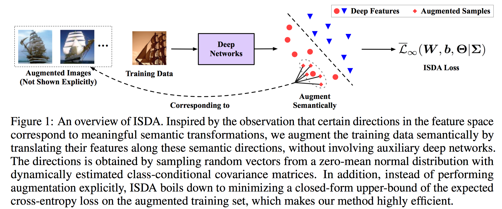
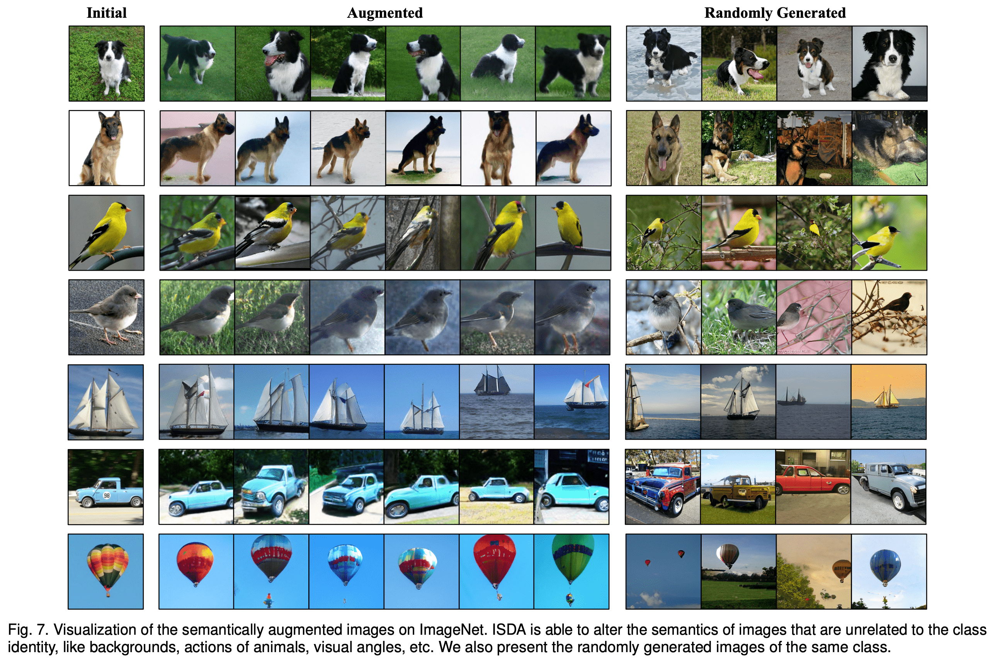
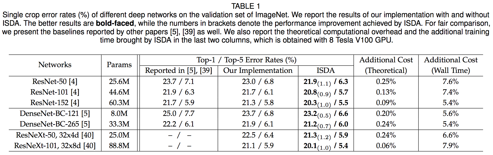

# ISDA-Pytorch

The Implicit Semantic Data Augmentation (ISDA) algorithm implemented in Pytorch.

- (NeurIPS 2019) [Implicit Semantic Data Augmentation for Deep Networks](https://arxiv.org/abs/1909.12220)

- (T-PAMI) [Regularizing Deep Networks with Semantic Data Augmentation](https://arxiv.org/abs/2007.10538)

**Update on 2021/04/23: Release Code for Visualizing Deep Features on ImageNet!**

**Update on 2021/01/17: Journal Version of ISDA is Accepted by T-PAMI!**

**Update on 2020/04/25: Release Pre-trained Models on ImageNet.**

**Update on 2020/04/24: Release Code for Image Classification on ImageNet and Semantic Segmentation on Cityscapes.**

## Introduction

We propose a novel implicit semantic data augmentation (ISDA) approach to complement traditional augmentation techniques like flipping, translation or rotation.
ISDA consistently improves the generalization performance of popular deep networks on supervised & semi-supervised image classification, semantic segmentation, object detection and instance segmentation.

<p align="center">
    
</p>


## Citation

If you find this work valuable or use our code in your own research, please consider citing us with the following bibtex:

```
@inproceedings{NIPS2019_9426,
        title = {Implicit Semantic Data Augmentation for Deep Networks},
       author = {Wang, Yulin and Pan, Xuran and Song, Shiji and Zhang, Hong and Huang, Gao and Wu, Cheng},
    booktitle = {Advances in Neural Information Processing Systems (NeurIPS)},
        pages = {12635--12644},
         year = {2019},
}

@article{wang2021regularizing,
        title = {Regularizing deep networks with semantic data augmentation},
       author = {Wang, Yulin and Huang, Gao and Song, Shiji and Pan, Xuran and Xia, Yitong and Wu, Cheng},
      journal = {IEEE Transactions on Pattern Analysis and Machine Intelligence},
         year = {2021},
          doi = {10.1109/TPAMI.2021.3052951}
}
```

## Get Started

Please go to the folder [Image classification on CIFAR](https://github.com/blackfeather-wang/ISDA-for-Deep-Networks/tree/master/Image%20classification%20on%20CIFAR), [Image classification on ImageNet](https://github.com/blackfeather-wang/ISDA-for-Deep-Networks/tree/master/Image%20classification%20on%20ImageNet) and [Semantic segmentation on Cityscapes](https://github.com/blackfeather-wang/ISDA-for-Deep-Networks/tree/master/Semantic%20segmentation%20on%20Cityscapes) for specific docs.

## Pre-trained Models on ImageNet

- Measured by Top-1 error.

|Model|Params|Baseline|ISDA|Model|
|-----|------|-----|-----|-----|
|ResNet-50  |25.6M |23.0|**21.9**|[Tsinghua Cloud](https://cloud.tsinghua.edu.cn/f/2ccd502cbf774b40a226/?dl=1) / [Google Drive](https://drive.google.com/open?id=1V2aYyrRY2EqKGxoEGUsHBwjHRMEVEj1N)|
|ResNet-101 |44.6M |21.7|**20.8**|[Tsinghua Cloud](https://cloud.tsinghua.edu.cn/f/4ac40c241b8941619109/?dl=1) / [Google Drive](https://drive.google.com/open?id=1LlmEc7UHgLRENpYb5xMOzcxtuABFhRyk)|
|ResNet-152 |60.3M |21.3|**20.3**|[Tsinghua Cloud](https://cloud.tsinghua.edu.cn/f/7707e8709b70446fb65e/?dl=1) / [Google Drive](https://drive.google.com/open?id=1yyGnqu1yegtje4Srn0PQK2_ZS1Q64Cv-)|
|DenseNet-BC-121 |8.0M |23.7|**23.2**|[Tsinghua Cloud](https://cloud.tsinghua.edu.cn/f/e5baa6f0ac2a42ba8421/?dl=1) / [Google Drive](https://drive.google.com/open?id=1m3KlCA0IS0OpG_Q0fHdGxuxtrCYCNYMj)|
|DenseNet-BC-265 |33.3M |21.9|**21.2**|[Tsinghua Cloud](https://cloud.tsinghua.edu.cn/f/ba91c2d5ce7b4650a143/?dl=1) / [Google Drive](https://drive.google.com/open?id=1RwFKPBs1KFnr3Ku0Q1Yuv24t-RvhDDiC)|
|ResNeXt50, 32x4d |25.0M|22.5|**21.3**|[Tsinghua Cloud](https://cloud.tsinghua.edu.cn/f/3ae2de3bdd13495ab181/?dl=1) / [Google Drive](https://drive.google.com/open?id=1vOHtNlMmjbEw0w96Xi855WZO0dCofEaw)|
|ResNeXt101, 32x8d|88.8M|21.1|**20.1**|[Tsinghua Cloud](https://cloud.tsinghua.edu.cn/f/7dcca2bd9cfa426bb52d/?dl=1) / [Google Drive](https://drive.google.com/open?id=1pOneh2C3inPpzite68EHJrsiw2TVfa74)|

## Visualization of Augmented Samples

- ImageNet
<p align="center">
    
</p>


## Results

- Supervised image classification on ImageNet
<p align="center">
    
</p>

- Complementing traditional data augmentation techniques
<p align="center">
    
</p>

- Semi-supervised image classification on CIFAR & SVHN
<p align="center">
    
</p>

- Semantic segmentation on Cityscapes
<p align="center">
    
</p>

- Object detection on MS COCO
<p align="center">
    
</p>

- Instance segmentation on MS COCO
<p align="center">
    
</p>

## Acknowledgment
Our code for semantic segmentation is mainly based on
[pytorch-segmentation-toolbox](https://github.com/speedinghzl/pytorch-segmentation-toolbox).

## To Do
Update code for semi-supervised learning.

